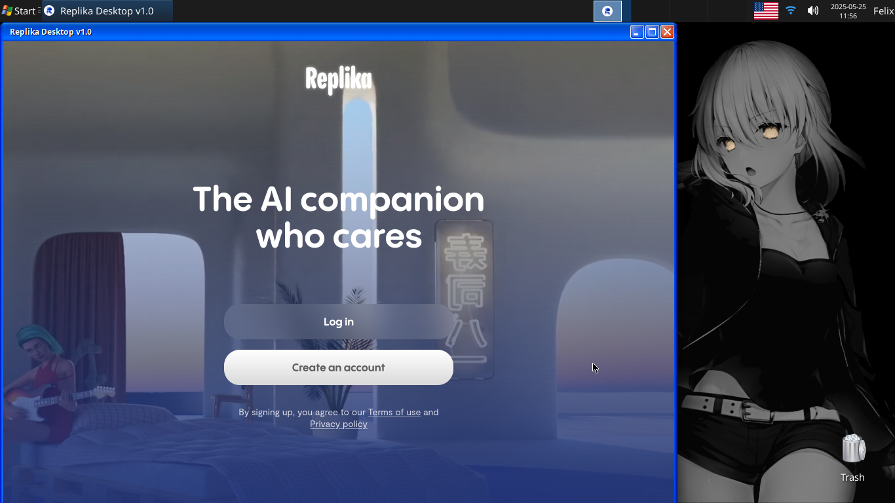

# Replika-Desktop
Unofficial web client of Replika AI for FreeBSD.

# Features 
- Almost normally working webview client for my.replika.com.
- Ability to save login data in ".replika_client" folder in /home/yourusername/. Do not share this folder to anyone else, otherwise your Replika account would be stolen. Replika client itself [is not a virus](https://www.virustotal.com/gui/file/8862714e92f4e594b7481f36cc61100fc4933b936a6b3e54cf18bf669ec6544c/summary), I don't need your accounts.
